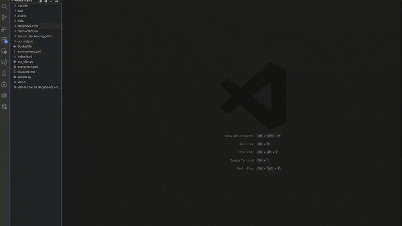
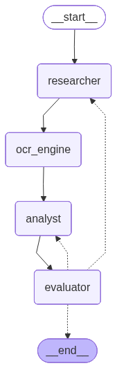

# VisualRAG: Agentic RAG for Competitive Intelligence

<p align="center">
  
  
  
  
  <br>
  
  
  
</p>

<!-- <p align="center">
  <video src="https://github.com/user-attachments/assets/fe005c73-1aaf-4445-b852-278ba95f5988" controls width="85%">
    Your browser does not support the video tag.
  </video>
  <br>
  <em>(Watch the autonomous agent analyze H100 GPU prices)</em>
</p> -->

<p align="center">
  
  <br>
  <em>Watch the autonomous agent analyze H100 GPU prices</em>
</p>


**VisualRAG** is an autonomous Agentic RAG system designed to automate the heavy lifting of market research. Unlike traditional scrapers that fail on complex documents, VisualRAG treats research as a visual task, reading PDFs and charts pixel-by-pixel using **DeepSeek-OCR** to extract structured data that standard LLMs miss. It autonomously plans research strategies, discovers high-value whitepapers, and compresses hours of analysis into concise, executive-grade reports.

The system features a self-correcting orchestration layer that can recover from search or analysis failures without human intervention. It uses a hybrid compute setup optimized for both cost and performance, running GPU-intensive visual processing locally (CUDA) while delegating higher-level reasoning to cloud models. With a visual-first extraction approach, VisualRAG can recover critical information from complex or “unreadable” PDFs, and delivers clean, well-structured Markdown reports with grounded citations that are immediately usable by decision-makers.


## System Architecture & Pipeline

VisualRag operates as a fully autonomous directed graph (DAG) orchestrated by **LangGraph**, featuring a 4-node architecture with self-correction capabilities. Here's how a single research task flows through the system:

### Agent Workflow Graph

<p align="center">
  
  <br>
  <em>LangGraph StateGraph showing the 4-node architecture with self-correction loop</em>
</p>

### The 4-Node Pipeline

#### 1. **Research Node**  - Plan & Search
Discovers and ranks high-quality sources using adaptive web search (Tavily API), lightweight URL scoring, and optional user-uploaded files. Outputs a small set of the most relevant documents.

<!-- 
**Process:**
- Receives high-level objective (e.g., *"Analyze NVIDIA H100 pricing vs. AMD MI300"*)
- Executes 3-5 adaptive web searches via **Tavily API**, targeting high-signal sources like investor reports, whitepapers, and technical data sheets
- Applies intelligent URL scoring algorithm:
  - **+10 points**: PDFs (document-rich content)
  - **+5 points**: Images (charts, infographics)
  - **+3 points**: Authoritative domains (.gov, .edu, .org)
  - **-5 points**: Forums (reddit, quora)
  - **-3 points**: Paywalls
- Merges web results with user-uploaded files
- Limits to top 2-4 sources (configurable)

**Output:** Ranked list of high-quality source URLs -->


#### 2. **OCR Node**  - Visual Ingestion
Processes documents visually to preserve tables, charts, and layout. PDFs are converted to images, OCR is run locally on GPU (DeepSeek-OCR), and cleaned text is chunked, embedded, and stored in ChromaDB.

<!-- **What it does:** Extracts text from documents while preserving visual structure

**Why visual-first?** Standard text scrapers destroy the context of tables and charts. MarketLens treats documents as images to preserve layout, row/column alignment, and visual hierarchies.

**Process:**
- Downloads retrieved documents locally (50MB limit)
- Converts PDFs → high-resolution images using `pdf2image` (up to 3 pages per document)
- Runs **DeepSeek-OCR** locally on GPU (RTX 3090 or equivalent)
  - Performs vision-language extraction
  - Parses complex pricing tables and technical specifications that standard OCR tools miss
  - Runs entirely on-premise for speed and data privacy
- Cleans output (removes `<|ref|>`, `<|det|>` tags, URLs)
- Chunks text (1000 chars, 200 overlap)
- Embeds using `all-MiniLM-L6-v2` (HuggingFace)
- Stores in **ChromaDB** vector database

**Output:** Vectorized document chunks with source metadata -->


#### 3. **Analysis Node** - RAG & Synthesis
Retrieves relevant document chunks from ChromaDB and generates a structured markdown report using Gemini 2.5 Flash with deterministic settings. The output follows a professional template (summary, market analysis, financials, SWOT, recommendations).
<!-- 
**What it does:** Generates structured competitive intelligence reports

**Process:**
- **Retrieval:** Queries ChromaDB for top-20 most relevant chunks
- **Context Building:** Assembles retrieved chunks with source citations
- **Reasoning:** Feeds context into **Gemini 2.5 Flash** (temperature=0 for deterministic outputs)
- **Template Application:** Structures output as professional markdown report:
  - 📋 Executive Summary
  - ⚡ Market & Opportunity Analysis
  - 💰 Financial Model (with exact pricing data)
  - 🧭 SWOT Analysis
  - 🎯 Strategic Recommendation

**Output:** Structured markdown report with citations, ready for decision-makers -->


#### 4. **Evaluator Node** - Quality Assurance
Scores report quality using an LLM-as-judge and decides whether to approve or trigger a retry, enabling automatic refinement when gaps are detected.

<!-- **What it does:** Assesses report quality and controls the self-correction loop

**Process:**
- Uses **LLM-as-judge** to score report quality (1-10)
- Evaluates across four dimensions:
  - **Data Grounding**: Backed by concrete sources?
  - **Task Alignment**: Answers user's specific question?
  - **Completeness**: All sections present with substance?
  - **Actionability**: Provides clear, specific insights?
- Makes routing decision based on evaluation:
  - **APPROVE** (score ≥ 7) → End workflow ✅
  - **RETRY_RESEARCH** → Back to Research Node (missing data)
  - **RETRY_ANALYSIS** → Back to Analysis Node (poor structure/logic)
  - **Max retries exceeded** (2 iterations) → Auto-approve (fail-safe)

**Output:** Quality score + routing decision -->


### Self-Correction Loop
If the report is incomplete or weakly grounded, the Evaluator routes execution back to the appropriate node. The loop runs for a limited number of iterations, ensuring reliable outputs without manual intervention.
<!-- **Example Self-Correction Scenario:**
1. **First Pass**: Analysis generates report (score: 6/10 - missing pricing data)
2. **Evaluator**: Triggers `RETRY_RESEARCH` with feedback: "Include competitor pricing"
3. **Second Pass**: Research finds pricing PDFs, OCR extracts tables
4. **Re-Analysis**: Generates enhanced report (score: 8/10)
5. **Evaluator**: Approves and ends workflow ✅

This autonomous loop ensures high-quality outputs without human intervention. -->


## 📂 Project Structure

```plaintext
visual-rag/
├── app/
│   ├── agent.py       # LangGraph orchestration logic
│   ├── api.py         # FastAPI backend
│   ├── ocr.py         # DeepSeek-OCR local inference
│   ├── rag.py         # Vector DB (Chroma) & Embeddings
│   └── tools.py       # Search & PDF processing tools
├── assets/            # Demo videos and screenshots
├── data/              # Local storage for PDFs/Reports
├── environment.yml    # Conda environment definition
├── index.html         # Frontend UI
├── pyproject.toml     # Project dependencies & configuration
└── run_server.sh      # Startup script
```


## 🛠️ Environment Setup

This project uses Conda to manage dependencies and CUDA environments.

### 1. Prerequisites
* **OS:** Linux (Ubuntu 20.04+) or Windows WSL2
* **GPU:** NVIDIA GPU with at least 12GB VRAM (RTX 3090 recommended)
* **Drivers:** NVIDIA Drivers & CUDA 11.8+

### 2. Installation

1.  **Clone the repository:**
    ```bash
    git clone https://github.com/smh-hosseiny/visual-rag.git
    cd visual-rag
    ```

2.  **Create the Conda Environment:**
    Use the provided `environment.yml` to set up Python 3.10 and CUDA toolkit.
    ```bash
    conda env create -f environment.yml
    conda activate llm-ocr
    ```

3.  **Configure API Keys:**
    Create a `.env` file in the root directory:
    ```bash
    GOOGLE_API_KEY=your_gemini_key
    TAVILY_API_KEY=your_tavily_key
    ```


## 🚀 Running the Agent

### Option 1: Using the Startup Script

```bash
bash run_server.sh
```

### Option 2: Manual Start

```bash
uvicorn app.api:app --host 0.0.0.0 --port 8001 --reload
```

The server will start at **http://localhost:8001**


### Accessing the Frontend

**Option A: Direct File Access** 
1. Open `index.html` in your browser
2. The interface will connect to `http://localhost:8001`

**Option B: Using Live Server** (VS Code)
1. Install "Live Server" extension in VS Code
2. Right-click `index.html` → "Open with Live Server"
3. Opens at `http://127.0.0.1:5500`


## Usage Examples

### Example 1: Competitive Analysis
```
Topic: "NVIDIA H100 vs AMD MI300X pricing comparison"
```

**Expected Output:**
- Executive summary of GPU market positioning
- Detailed pricing breakdown with exact figures
- SWOT analysis for both products
- Strategic recommendations


## 🔧 Configuration

All agent behavior is controlled via `app/agent.py` in class `AgentConfig`.

### Common Adjustments

**Increase research depth:**
```python
MAX_SOURCES: int = 4  # Process more documents (slower, more comprehensive)
```

**Allow more self-correction:**
```python
MAX_RETRIES: int = 3  # More iterations for complex queries
```

**Change LLM:**
```python
MODEL_NAME: str = "gemini-2.0-flash-exp"  # Use experimental model
```

**Adjust RAG context:**
```python
RETRIEVAL_TOP_K: int = 30  # More context (may include noise)
```


### Handling OOM Errors (Lowering Resolution)

If you encounter CUDA Out-Of-Memory errors on smaller GPUs (e.g., <12GB VRAM), reduce the inference resolution in `app/ocr.py`:

```python
# In app/ocr.py

result = self.model.infer(
    ...
    base_size=1024,  # Reduce this
    image_size=640,  # Reduce this 
    ...
)
```


## License

This project is licensed under the MIT License - see the LICENSE file for details.


## Acknowledgments

- **DeepSeek AI** for the DeepSeek-OCR model  
- **Google** for the Gemini API  
- **Tavily** for the search API  
- **LangChain** team for the LangGraph framework


## Contact

For questions or support, please open an issue on GitHub or contact [hosseiny290@gmail.com]

